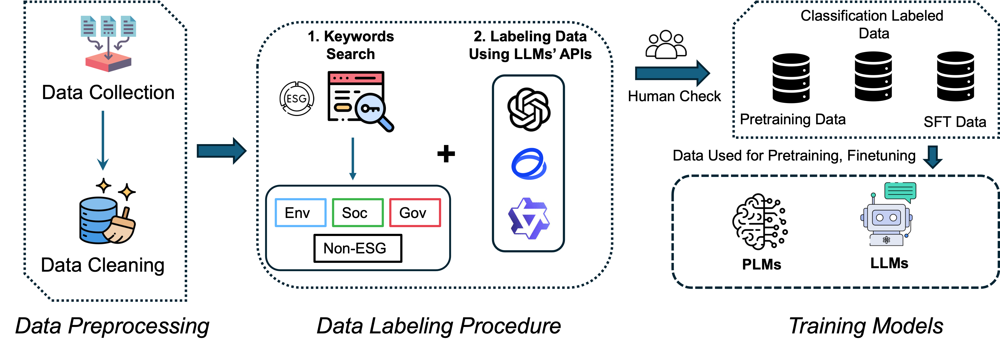

# 🌍📊 Using Pre-trained Language Models for Accurate ESG Prediction 📊🌍

This repository contains the resources and methodologies developed in our research project focused on leveraging Pre-trained Language Models (PLMs) for enhanced Environmental, Social, and Governance (ESG) data prediction and classification.

🔥 News: Our paper has been published at [FinNLP2024@IJCAI](https://aclanthology.org/2024.finnlp-2.1/).

## 📄 Project Overview

Our project aims to address significant gaps in ESG analysis by introducing novel datasets, refining PLMs for ESG categorization, and developing domain-specific models that significantly outperform existing benchmarks. The project encompasses the creation of specialized datasets, the extension of PLMs with ESG-specific data, and the introduction of innovative ESG classification methodologies.

### Pipeline Overview



This diagram illustrates the comprehensive pipeline developed for our project, including data collection, pre-processing, model training, and classification tasks.

### Divide Classification Task


This image depicts the breakdown of our ESG classification task into subtasks, illustrating the detailed approach taken to categorize ESG data effectively.

## 📥 Download Resources

To facilitate further research and application, we have made our datasets and models available for download through the following links:

### 📊 Datasets

- **Google Drive**: [Download Datasets from Google Drive](https://drive.google.com/drive/folders/1PWQqt_1GQvmARwYpni1n9QlHO2J-n9Ni?usp=drive_link)
- **OneDrive**: [Download Datasets from OneDrive](https://connecthkuhk-my.sharepoint.com/:f:/g/personal/u26125xl_connect_hku_hk/EoXJsx9B--ZCgI80Mom0nswBkYwPiiu8Uo1hr4Dtjlo45Q?e=pldO3e)

### 🧠 Models

- **Google Drive**: [Download Models from Google Drive](https://drive.google.com/drive/folders/1rMFWsNnmiABWESJxxqjjbRcT_nsrMfq8?usp=sharing)
- **OneDrive**: [Download Models from OneDrive](https://connecthkuhk-my.sharepoint.com/:f:/g/personal/u26125xl_connect_hku_hk/EjzzNw9N0yRLkaP3amdeguEB5TpVqsCvUX7Z5TvJCeLb4w?e=DGqDvg)

## 🎯 Key Contributions

- **📂 Specialized ESG Datasets**: We provide three unique datasets tailored for ESG analysis, including a pre-training corpus, a labeled classification dataset in four-class and nine-class configurations, and an ESG Supervised Fine-Tuning (SFT) dataset augmented with LLM-generated conversational histories.

- **🚀 Model Enhancement**: By extending BERT, DistilRoBERTa, and RoBERTa models with our ESG datasets, we've significantly improved their performance in ESG classification tasks, establishing new standards of accuracy.

- **🔧 ESG Classification Pipeline**: A robust pipeline for ESG data annotation leverages keyword searches and LLM API integrations for precise data categorization.

- **📈 Domain-Specific Models**: Introduction of ESGLlama and FinLlama, fine-tuned on our datasets, demonstrating superior ESG classification capabilities.

## 🏆 Results

In this work, we sought to address critical voids within the realm of ESG analysis by providing novel resources and methodologies that significantly enhance the classification and understanding of ESG data. By extending pre-trained models with our ESG-specific datasets, and training three ESG domain-specific PLMs: ESG-BERT, ESG-DistilRoBERTa, and ESG-RoBERTa, we have achieved notable improvements in model performance, setting new benchmarks for ESG classification tasks.

Our innovative pipeline for dataset annotation, leveraging both keyword searches and Large Language Model (LLM) APIs, has enabled precise and comprehensive categorization of ESG data into both four-class and nine-class schemas. This approach not only enhances the granularity of our analysis but also contributes to the broader academic and practical understanding of ESG issues. Moreover, the introduction of ESGLlama and FinLlama, domain-specific language models fine-tuned on our datasets, represents a significant leap forward in the application of LLMs to ESG-related tasks. These models have demonstrated exceptional proficiency in ESG classification, outperforming existing benchmarks and showcasing the efficacy of specialized fine-tuning in domain-specific contexts.

### 📑 Citation

If you use our datasets or models in your research, please cite our work as follows:

```bibtex
@inproceedings{xia-etal-2024-using,
    title = "Using Pre-trained Language Model for Accurate {ESG} Prediction",
    author = "Xia, Lei  and
      Yang, Mingming  and
      Liu, Qi",
    booktitle = "Proceedings of the Eighth Financial Technology and
      Natural Language Processing and the 1st Agent AI for Scenario Planning",
    month = "3 " # aug,
    year = "2024",
    address = "Jeju, South Korea",
    url = "https://aclanthology.org/2024.finnlp-2.1",
    pages = "1--22",
}
```
